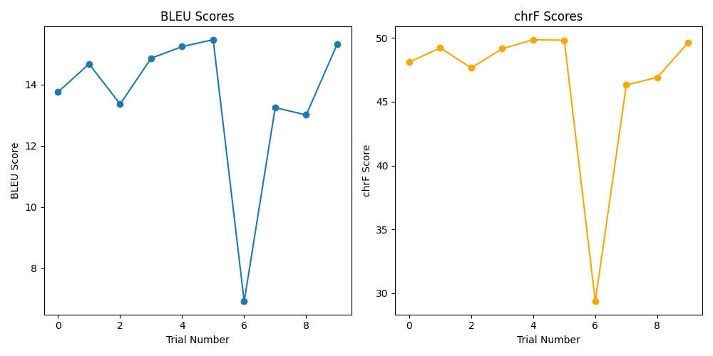

  <h1>Machine Translation (Spanish to Quechua)</h1>
  
  

  
  <h2>Overview</h2>
  
This repository presents a preview of the best-performing machine translation model trained to translate Spanish text into Quechua. Optuna was utilized for hyperparameter optimization, focusing on refining model parameters for improved translation accuracy. The dataset used is sourced from "somosnlp-hackathon-2022/spanish-to-quechua" on Hugging Face.

  
  <h2>Repository Structure</h2>
  <ul>
    <li><code>optuna_results_plot.png</code>: Visualization of hyperparameter optimization results using Optuna.</li>
    <li><code>Translate.py</code>: Main script for translating text using the trained model.</li>
    <li><code>es-qu-MarianMTModel-Best/</code>: Directory containing various files related to the best performing model:
      <ul>
        <li><code>config.json</code>: Model configuration.</li>
        <li><code>generation_config.json</code>: Generation-specific configuration.</li>
        <li><code>model.safetensors</code>: Saved model parameters.</li>
        <li><code>source.spm</code>: Source language tokenizer model.</li>
        <li><code>special_tokens_map.json</code>: Special tokens mapping.</li>
        <li><code>target.spm</code>: Target language tokenizer model.</li>
        <li><code>tokenizer_config.json</code>: Tokenizer configuration.</li>
        <li><code>vocab.json</code>: Model vocabulary.</li>
      </ul>
    </li>
  </ul>
  
  <h2>Requirements</h2>
  
  
Install dependencies using <code>requirements.txt</code>:

  
  <pre><code>pip install -r requirements.txt</code></pre>
  
  <h2>Usage</h2>
  
To translate text using the trained model, run:

   <pre><code>
      if __name__ == "__main__":
          sentence = "Your sentence goes here" 
          translated = translate_sentence(sentence, model, tokenizer)
          print(f"Original: {sentence}")
          print(f"Translated: {translated})
   </code></pre>
  
  
Replace <code>Your sentence goes here</code> with the sentence you want to translate. The translation will be displayed in the console.

  
